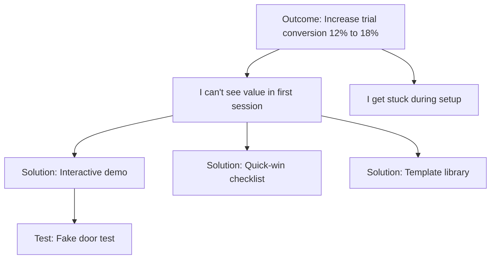

# OST Builder

Create and maintain Opportunity Solution Trees that guide continuous discovery and product decisions.

## What is an Opportunity Solution Tree?

A visual tree with four layers:
1. **Outcome** (root) - The business/product result you're driving toward
2. **Opportunities** - Unmet needs, pain points, and desires from customers
3. **Solutions** - Ideas to address those opportunities
4. **Assumption Tests** - Experiments to validate solutions

## Purpose

Shift teams from being told "build these features" to figuring out "what should we build to achieve this outcome?"

The tree adds structure to an otherwise messy, wide-open problem.

## Tree Structure

```
                    [OUTCOME]
                        |
        +--------------+--------------+
        |              |              |
   [OPPORTUNITY]  [OPPORTUNITY]  [OPPORTUNITY]
        |              |              |
    +---+---+      +---+---+      +---+---+
    |   |   |      |   |   |      |   |   |
   [S] [S] [S]    [S] [S] [S]    [S] [S] [S]
    |              |              |
  [TEST]         [TEST]         [TEST]
```

**Key principles**:
- ONE outcome at the root
- Opportunities organized by experience map phases
- Multiple solutions per opportunity (enables comparison)
- Tests under each solution being pursued

## Layer 1: Outcome

The root of your tree. A single, measurable business/product goal.

### Good Outcomes
- "Increase trial-to-paid conversion from 12% to 18%"
- "Reduce time-to-first-value from 7 days to 2 days"
- "Increase daily active users by 25%"
- "Reduce customer support tickets by 40%"

### Bad Outcomes
- "Build a better product" (not measurable)
- "Make users happy" (vague)
- "Launch feature X" (output, not outcome)

### Outcome Template
```
[Outcome]: [Metric] from [current] to [target] by [date]
Why it matters: [Business impact]
How we'll measure: [Specific metric definition]
```

## Layer 2: Opportunities

Customer needs organized by experience map phases.

### Structure by Experience Map

Group opportunities by the customer journey:

**Example: Project Management Tool**
1. **Getting Started Phase**
   - "I don't know where to begin setting up my workspace"
   - "I can't import my existing work from other tools"

2. **Daily Planning Phase**
   - "I can't see all my tasks across projects in one view"
   - "I spend too much time updating task status"

3. **Collaboration Phase**
   - "I can't tell who's blocked waiting on me"
   - "I have to repeat context in multiple places"

4. **Progress Tracking Phase**
   - "I can't show my progress to stakeholders quickly"
   - "I don't know if I'm on track to hit my deadline"

### Vertical Depth

Opportunities should decompose vertically:

```
[Big Opportunity]: "I can't manage my time across calendars"
    |
    +-- [Medium]: "I can't see all my meetings in one place"
    |       |
    |       +-- [Small]: "I have to check 3 different apps"
    |
    +-- [Medium]: "I miss meetings because they're not synced"
            |
            +-- [Small]: "My phone doesn't alert me for work calendar events"
```

**Each level should be**:
- More specific than its parent
- A contributing factor to the parent
- Actionable (can generate solution ideas)

### Opportunity Quality Checklist
- [ ] Written as a need, not a solution
- [ ] Specific and concrete
- [ ] Traceable to customer interview
- [ ] Tagged with experience map phase
- [ ] Includes supporting evidence (quote)

## Layer 3: Solutions

Ideas to address opportunities. MULTIPLE solutions per opportunity.

### Why Multiple Solutions?

Compare and contrast to:
- Avoid over-committing to first idea
- Find better approaches through comparison
- Reduce confirmation bias
- Enable parallel testing

**Minimum: 3 solutions per opportunity you're pursuing**

### Solution Diversity

For opportunity: "I can't see all my tasks across projects in one view"

**Solution 1 (Aggregation)**: "All Tasks" view that shows every task from every project in a master list

**Solution 2 (Smart filtering)**: Dynamic filters that remember your most common task queries

**Solution 3 (Dashboard)**: Customizable dashboard with task widgets you can arrange

**Solution 4 (Search-first)**: Powerful search that surfaces tasks as you type your intent

### Solution Template
```
[Solution]: [Brief description of the idea]
How it addresses the opportunity: [Connection to customer need]
Assumptions:
- [Key assumption 1]
- [Key assumption 2]
- [Key assumption 3]
Status: [Idea | Testing | Validated | Invalidated | Shipped]
```

## Layer 4: Assumption Tests

Experiments to validate (or invalidate) solutions before building them.

### Identify Assumptions

Every solution has underlying assumptions. Make them explicit.

**Solution**: "Smart filtering that remembers common queries"

**Assumptions**:
1. Users have repeated query patterns (not random searches)
2. Users will notice and use auto-suggested filters
3. Remembering queries saves meaningful time vs. recreating them
4. 5 saved filters is the right amount (not too many, not too few)

### Test Design

For each critical assumption, design a small test.

**Assumption**: "Users will notice and use auto-suggested filters"

**Test Options**:
- **Fake door test**: Add the UI element but have it "coming soon" - measure clicks
- **Wizard of Oz**: Manually create suggested filters for 10 users, track usage
- **Prototype test**: Clickable mock with 5 users, observe if they discover it
- **Concierge**: Manually create filters for users, ask if they use them

**Pick the test that**:
- Validates the riskiest assumption first
- Can be run in less than 1 week
- Requires minimal build effort
- Gives clear signal (not ambiguous data)

### Test Template
```
[Assumption]: [What needs to be true]
Riskiness: [High | Medium | Low]
Test method: [Specific test type]
Success criteria: [What would prove it true]
Failure criteria: [What would prove it false]
Timeline: [How long to run]
Result: [Pending | Validated | Invalidated]
Learning: [What we discovered]
```

## Building a New Tree

### Step 1: Define the Outcome
Work with stakeholders to clarify:
- What metric are we moving?
- From what to what?
- By when?
- Why does this matter to the business?

### Step 2: Map the Experience
Create an experience map for the customer journey:
1. Trigger/entry point
2. Core usage phases (3-5 phases)
3. Exit/completion point

Use interviews and observation to validate this map.

### Step 3: Populate Opportunities
From customer interviews, extract opportunities and organize by experience map phases.

Start with **20-30 opportunities** to show breadth of the problem space.

### Step 4: Select Target Opportunities
You can't pursue all opportunities at once. Select 1-3 to focus on based on:
- Impact on outcome
- Customer pain intensity
- Feasibility to address
- Strategic alignment

### Step 5: Generate Solutions
For each target opportunity, generate **at least 3 diverse solutions**.

### Step 6: Identify Assumptions
For each solution you're considering, list all assumptions that must be true for it to work.

### Step 7: Design Tests
For the riskiest assumptions, design small tests you can run this week.

### Step 8: Run Tests and Learn
Execute tests, gather data, update the tree with learnings.

## Maintaining the Tree

The OST is a **living document**. Update it continuously.

### Weekly Updates

**After customer interviews**:
- Add new opportunities discovered
- Add evidence to existing opportunities
- Increase confidence in validated opportunities
- Adjust experience map if needed

**After assumption tests**:
- Mark tests as validated or invalidated
- Update solution status
- Archive invalidated solutions
- Add new solutions based on learnings

**During team sync**:
- Review what's in flight
- Decide which opportunities to pursue next
- Identify which assumptions to test next
- Celebrate learnings (not just successes)

### Visual Maintenance

Keep the tree readable:
- Archive opportunities that lose relevance
- Collapse solved opportunities
- Highlight current focus areas
- Use color coding for confidence levels
- Date stamp major changes

## Quality Standards

### A Good OST Has:

- [ ] One clear, measurable outcome at the root
- [ ] Opportunities organized by experience map
- [ ] Opportunities written as needs (not solutions!)
- [ ] Customer quotes as evidence for opportunities
- [ ] Multiple solutions per active opportunity
- [ ] Explicit assumptions listed for each solution
- [ ] Active tests for riskiest assumptions
- [ ] Regular updates (at least weekly)
- [ ] Visual clarity (not a tangled mess)
- [ ] Shared ownership across PM, design, engineering

### A Bad OST Has:

- Multiple outcomes competing for attention
- Opportunities that are really solutions
- No connection to customer evidence
- One solution per opportunity (no comparison)
- No assumptions identified
- No active tests
- Hasn't been updated in weeks
- Too complex to understand at a glance
- Only the PM knows what's on it

## Common Mistakes

### Mistake 1: Opportunities written as solutions
**The #1 failure**: 98% of people make this mistake.

Fix: Use the opportunity-framing skill to validate every opportunity statement.

### Mistake 2: Staying too shallow
Opportunities remain broad and vague.

Fix: Decompose vertically. Go at least 3 levels deep in your highest-priority opportunity.

### Mistake 3: One solution per opportunity
Eliminates ability to compare.

Fix: Force yourself to generate at least 3 solutions before picking one.

### Mistake 4: No active tests
Tree becomes a planning document, not a discovery tool.

Fix: Always have 5-10 active tests running. If not, you're not doing continuous discovery.

### Mistake 5: Treating it as a phase
Build the tree once, then "start building."

Fix: Discovery and delivery happen in parallel. Update the tree weekly forever.

### Mistake 6: Not grounded in interviews
Opportunities based on assumptions, not customer evidence.

Fix: Conduct weekly customer interviews. Every opportunity should cite an interview.

### Mistake 7: Too complex to understand
Tree has 200 branches and no one can parse it.

Fix: Focus on current area of exploration. Archive or collapse the rest.

## Tree Evolution Over Time

### Week 1-2: Initial Tree
- Define outcome
- Create experience map
- Populate 20-30 opportunities from initial interviews
- Select 1-2 target opportunities
- Generate 3+ solutions per opportunity
- Identify assumptions

### Week 3-8: Early Discovery
- Run assumption tests weekly
- Add opportunities from weekly interviews
- Increase confidence in validated opportunities
- Archive or deprioritize opportunities with low signal
- Update solutions based on test learnings
- Start building highest-confidence solutions

### Month 3-6: Continuous Discovery
- Tree becomes living document
- Opportunities constantly refined
- New opportunities added from interviews
- Solutions regularly tested and shipped
- Team references tree in all product decisions
- Metrics tracked against outcome

### Month 6+: Mature Practice
- Tree structure is second nature
- Team can't imagine working without it
- Discovery and delivery fully parallel
- Outcome tracking shows progress
- New outcomes branched as old ones achieved

## Output Formats

### Format 1: Mermaid Diagram


### Format 2: Nested Markdown
```
# Outcome: Increase trial conversion from 12% to 18%

## Opportunity: I can't see value in first session
Evidence: "I signed up but didn't know what to do first. I closed the tab." - Interview #12

### Solution: Interactive demo
Assumptions:
- Users learn better by doing than watching
- Demo can be completed in <5 minutes
- Demo shows most valuable features

#### Test: Prototype with 10 users
Status: Running
Success criteria: 8/10 complete demo and continue to product

### Solution: Quick-win checklist
[Continue...]
```

### Format 3: Table View
| Phase | Opportunity | Confidence | Solutions | Tests Active |
|-------|-------------|------------|-----------|--------------|
| Setup | I don't know where to start | High (12 interviews) | 3 | 2 |
| Planning | I can't see all my tasks | Medium (5 interviews) | 4 | 1 |

## Tool Recommendations

### Visual Tools
- **Miro/Mural**: Collaborative, great for workshops
- **FigJam**: If your team uses Figma
- **Lucidchart**: Structured diagrams
- **Paper/Whiteboard**: Best for team collaboration

### Documentation Tools
- **Notion**: Good for nested structure and evidence linking
- **Confluence**: If you're enterprise
- **Markdown files**: Simple, version-controlled

**Most important**: Pick what your team will actually use and update.

## Team Collaboration

### The Trio
OST work is done by the product trio:
- **PM**: Drives outcome, prioritizes opportunities
- **Designer**: Explores solutions, designs tests
- **Engineer**: Assesses feasibility, builds tests

All three should contribute to the tree.

### Weekly OST Review
- 30-minute standing meeting
- Review learnings from past week
- Update tree together
- Decide what to test next
- Assign test ownership

### Stakeholder Communication
Use the tree to communicate:
- "Here's where we're exploring and why"
- "Here's what we've learned"
- "Here's what we're testing next"
- "Here's how this connects to our outcome"

Much better than feature lists.

## Success Metrics

You know your OST practice is working when:

- Team references the tree in daily decisions
- New learnings update the tree weekly
- Multiple tests running every week
- Discovery and delivery happen in parallel
- Stakeholders understand your exploration
- You can trace shipped features back to opportunities
- You're hitting your outcome metrics
- Team can articulate customer needs clearly
- Solutions are grounded in customer evidence
- You're regularly invalidating ideas (not just validating)

## Getting Unstuck

### "We have no opportunities"
Go interview 5 customers. Opportunities will emerge.

### "All our opportunities are solutions"
Use the opportunity-framing skill on each statement. Ask "What problem does that solve?"

### "We can't decide which opportunity to pursue"
Pick the one with strongest customer evidence AND highest impact on outcome.

### "We're not finding new opportunities"
Interview different customer segments. Or different journey phases. Or ask different questions.

### "Our tree is too messy"
Archive opportunities you're not pursuing. Focus on current exploration area.

### "Leadership wants a roadmap, not a tree"
Show how the tree connects to outcomes they care about. Translate opportunities to business impact.

### "We don't have time for continuous discovery"
You don't have time NOT to. Discovery prevents building the wrong thing (massive time waste).
