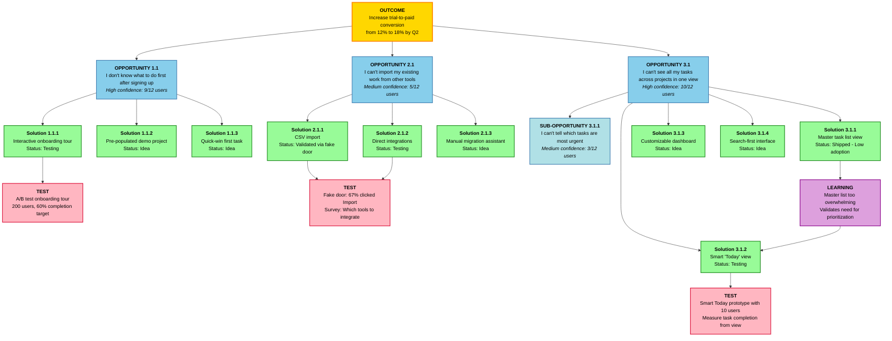

# SaaS Project Management Tool - Opportunity Solution Tree

## Outcome
Increase trial-to-paid conversion from 12% to 18% by Q2

## Visual Tree

## Legend

- **Gold** - Outcome (root goal)
- **Sky Blue** - Opportunities (customer needs)
- **Light Blue** - Sub-opportunities (decomposed needs)
- **Green** - Solutions (multiple approaches per opportunity)
- **Pink** - Active Tests (validation experiments)
- **Purple** - Learnings (insights from tests)

## Experience Map Phases

1. **Sign-up & First Session**
2. **Setup & Configuration**
3. **Daily Task Management**
4. **Team Collaboration**
5. **Progress Tracking**
